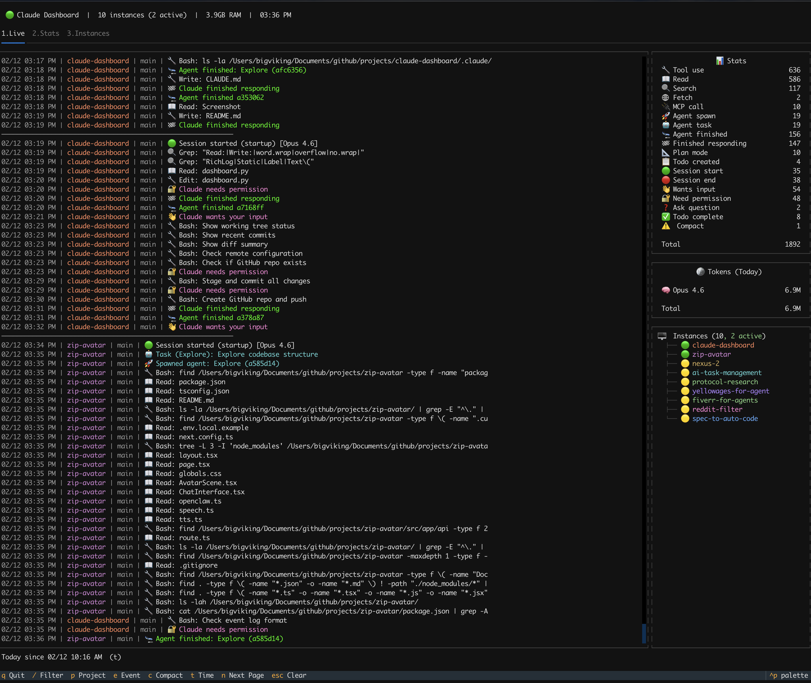

# Claude Code Dashboard

A terminal dashboard for monitoring Claude Code activity in real-time. Built with [Textual](https://textual.textualize.io/) and [Rich](https://rich.readthedocs.io/).



## Features

- **Live event feed** — Real-time stream of tool calls, reads, searches, agent spawns, session starts/ends, and more
- **Token usage tracking** — Per-model token breakdown with cache hit ratios (Opus, Sonnet, Haiku)
- **Process monitoring** — Detect all running Claude instances with CPU, memory, uptime, MCP servers, and active shell commands
- **Agent tree visualization** — See nested agent hierarchies with live spinner indicators
- **Historical stats** — Daily token usage table with pagination, session/message counts, averages
- **Filtering** — Filter by project, event type, text search, or time range (Today / 7d / All)
- **Compact mode** — Collapse consecutive same-type events into grouped counts

## Install

```bash
pip install textual rich
```

## Usage

```bash
python3 dashboard.py
```

The dashboard reads from `~/.claude/` — the same directory Claude Code writes its event logs and stats to. No configuration needed.

## Keyboard Shortcuts

| Key | Action |
|-----|--------|
| `1` `2` `3` | Switch tabs (Live, Stats, Instances) |
| `t` | Cycle time range: Today → 7d → All |
| `/` | Open text filter |
| `p` | Cycle project filter |
| `e` | Cycle event type filter |
| `c` | Toggle compact mode |
| `n` | Next page (daily token table) |
| `j` / `k` | Scroll down / up |
| `G` / `g` | Jump to end / start |
| `Esc` | Clear all filters |
| `q` | Quit |

## Tabs

### 1. Live

Real-time event log with a sidebar showing:
- Event counts by type
- Token usage per model
- Running Claude instances with status indicators

### 2. Stats

- Session and message totals with daily averages
- Paginated daily token usage table broken down by model
- Supplemented with live data when the stats cache is stale

### 3. Instances

Full table of running Claude processes with:
- CPU / memory / uptime
- Claude version and MCP server count
- Active shell commands and subagent status
- Working directory

## Data Sources

The dashboard is read-only and monitors these files in `~/.claude/`:

| File | What it provides |
|------|-----------------|
| `events.log` | Real-time event stream |
| `token-stats` | Aggregate token counts |
| `model-stats` | Per-model token breakdown |
| `stats-cache.json` | Historical daily activity and token data |

## Requirements

- Python 3.10+
- macOS (uses `ps` and `lsof` for process detection)
- [Claude Code](https://claude.ai/code) writing to `~/.claude/`

## License

MIT
