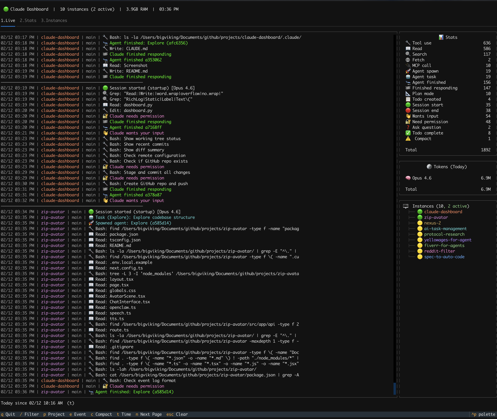

# Claude Code Dashboard

A real-time terminal dashboard for monitoring everything Claude Code is doing across your machine. Track live events, token usage, running instances, and agent hierarchies — all from a single TUI built with [Textual](https://textual.textualize.io/) and [Rich](https://rich.readthedocs.io/).



## What It Does

Claude Code writes event logs, token stats, and process data to `~/.claude/` as it works. This dashboard reads those files and presents a live, read-only view of all Claude activity on your system — no configuration or API keys needed.

- **Watch every tool call in real time** — see file reads, searches, edits, bash commands, MCP calls, and agent spawns as they happen
- **Track token spend per model** — per-model breakdowns (Opus, Sonnet, Haiku) with cache hit ratios, daily totals, and historical trends
- **Monitor all running instances** — CPU, memory, uptime, working directory, MCP server count, active shell commands, and subagent status for every Claude process
- **Visualize agent trees** — nested session and agent hierarchies with live spinner indicators showing which agents are active
- **Filter and search** — narrow the event feed by project, event type, text search, or time range (Today / 7d / All)
- **Compact mode** — collapse consecutive same-type events into grouped counts to reduce noise

## Quick Start

```bash
git clone https://github.com/mhofwell/claude-dashboard.git
cd claude-dashboard
pip install textual rich
python3 dashboard.py
```

The dashboard picks up data from `~/.claude/` automatically — just make sure [Claude Code](https://claude.ai/code) is installed and has been used at least once.

To launch it from anywhere as `claude-dash`, add this to your `~/.zshrc` (or `~/.bashrc`):

```bash
alias claude-dash="python3 /path/to/claude-dashboard/dashboard.py"
```

Then reload your shell (`source ~/.zshrc`) and run `claude-dash` from any directory.

## Keyboard Shortcuts

| Key | Action |
|-----|--------|
| `1` `2` `3` | Switch tabs (Live, Stats, Instances) |
| `t` | Cycle time range: Today / 7d / All |
| `/` | Open text filter |
| `p` | Cycle project filter |
| `e` | Cycle event type filter |
| `c` | Toggle compact mode |
| `n` | Next page (daily token table) |
| `j` / `k` | Scroll down / up |
| `G` / `g` | Jump to end / start |
| `Esc` | Clear all filters |
| `q` | Quit |

## Tabs

### 1. Live

Real-time event log with a sidebar showing:
- Event counts by type (tool calls, reads, searches, agents, sessions, etc.)
- Token usage per model for the current time range
- Running Claude instances with status indicators and project colors

### 2. Stats

- Session and message totals with daily averages
- Paginated daily token usage table broken down by model
- Supplemented with live data when the stats cache is stale

### 3. Instances

Full table of every running Claude process with:
- CPU / memory / uptime
- Claude version and MCP server count
- Active shell commands and subagent status
- Working directory

## Data Sources

The dashboard is read-only and monitors these files in `~/.claude/`:

| File | What it provides |
|------|-----------------|
| `events.log` | Real-time event stream (tool calls, session starts/ends, agent activity) |
| `token-stats` | Aggregate token counts across all models |
| `model-stats` | Per-model token breakdown (input, output, cache read/write) |
| `stats-cache.json` | Historical daily activity, token data, and model usage |

## Supabase Exporter

The `exporter/` directory contains a TypeScript/Bun daemon that syncs the same telemetry to an external Supabase database. This lets you build web dashboards, run queries, or share activity data beyond your local machine.

### 1. Create a Supabase Project

Sign up at [supabase.com](https://supabase.com) and create a new project. Note your **Project URL** and **Service Role Key** from Settings > API.

### 2. Create the Database Schema

Run the following SQL in the Supabase SQL Editor (or via migrations):

```sql
-- Projects table
CREATE TABLE projects (
  name TEXT PRIMARY KEY,
  visibility TEXT NOT NULL DEFAULT 'public',
  first_seen TIMESTAMPTZ NOT NULL DEFAULT now(),
  last_active TIMESTAMPTZ NOT NULL DEFAULT now(),
  total_events INTEGER NOT NULL DEFAULT 0,
  status TEXT NOT NULL DEFAULT 'idea',
  state TEXT NOT NULL DEFAULT 'private',
  content_slug TEXT UNIQUE
);

-- Events table
CREATE TABLE events (
  id BIGINT GENERATED BY DEFAULT AS IDENTITY PRIMARY KEY,
  timestamp TIMESTAMPTZ NOT NULL,
  project TEXT NOT NULL,
  branch TEXT,
  emoji TEXT,
  event_type TEXT NOT NULL,
  event_text TEXT NOT NULL
);

CREATE INDEX idx_events_ts ON events (timestamp DESC);
CREATE INDEX idx_events_project_ts ON events (project, timestamp DESC);
CREATE INDEX idx_events_type_ts ON events (event_type, timestamp DESC);
CREATE INDEX idx_events_project_type_ts ON events (project, event_type, timestamp DESC);

-- Daily metrics table
CREATE TABLE daily_metrics (
  id BIGINT GENERATED BY DEFAULT AS IDENTITY PRIMARY KEY,
  date DATE NOT NULL,
  project TEXT,
  messages INTEGER NOT NULL DEFAULT 0,
  sessions INTEGER NOT NULL DEFAULT 0,
  tool_calls INTEGER NOT NULL DEFAULT 0,
  tokens JSONB
);

CREATE UNIQUE INDEX idx_daily_metrics_unique
  ON daily_metrics (date, COALESCE(project, '__global__'));
CREATE INDEX idx_daily_metrics_date ON daily_metrics (date DESC);
CREATE INDEX idx_daily_metrics_project ON daily_metrics (project, date DESC);

-- Facility status (singleton row)
CREATE TABLE facility_status (
  id INTEGER PRIMARY KEY DEFAULT 1,
  status TEXT NOT NULL DEFAULT 'dormant',
  active_agents INTEGER NOT NULL DEFAULT 0,
  active_projects JSONB DEFAULT '[]',
  tokens_lifetime BIGINT NOT NULL DEFAULT 0,
  tokens_today BIGINT NOT NULL DEFAULT 0,
  sessions_lifetime INTEGER NOT NULL DEFAULT 0,
  messages_lifetime INTEGER NOT NULL DEFAULT 0,
  model_stats JSONB DEFAULT '{}',
  hour_distribution JSONB DEFAULT '{}',
  first_session_date TIMESTAMPTZ,
  updated_at TIMESTAMPTZ NOT NULL DEFAULT now(),
  agents_by_project JSONB DEFAULT '{}'
);

-- Seed the singleton row
INSERT INTO facility_status (id) VALUES (1);
```

### 3. Configure and Run

```bash
cd exporter
cp .env.example .env
```

Edit `.env` with your Supabase credentials:

```
SUPABASE_URL=https://your-project.supabase.co
SUPABASE_SERVICE_ROLE_KEY=your-service-role-key-here
```

Install dependencies and start:

```bash
bun install
bun run index.ts --backfill   # first run: import all history
bun run index.ts              # subsequent runs: incremental daemon
```

### What Gets Synced

| Table | Contents |
|-------|----------|
| `events` | Every tool call, session start/end, agent spawn — one row per log line |
| `projects` | One row per project with name, visibility, first seen, last active, event count |
| `daily_metrics` | Global rows (from stats-cache.json) + per-project rows with tokens, sessions, messages, tool calls |
| `facility_status` | Live singleton snapshot: status, active agents, per-project agent counts, token totals, model stats, hourly distribution |

The daemon pushes facility status every cycle (30s when active, 5min when dormant) and syncs daily metrics periodically. Use `--backfill` on first run to import all historical data.

## Requirements

- Python 3.10+
- macOS (uses `ps` and `lsof` for process detection)
- [Claude Code](https://claude.ai/code) writing to `~/.claude/`
- **Exporter only:** [Bun](https://bun.sh/) and a Supabase project

## License

MIT
